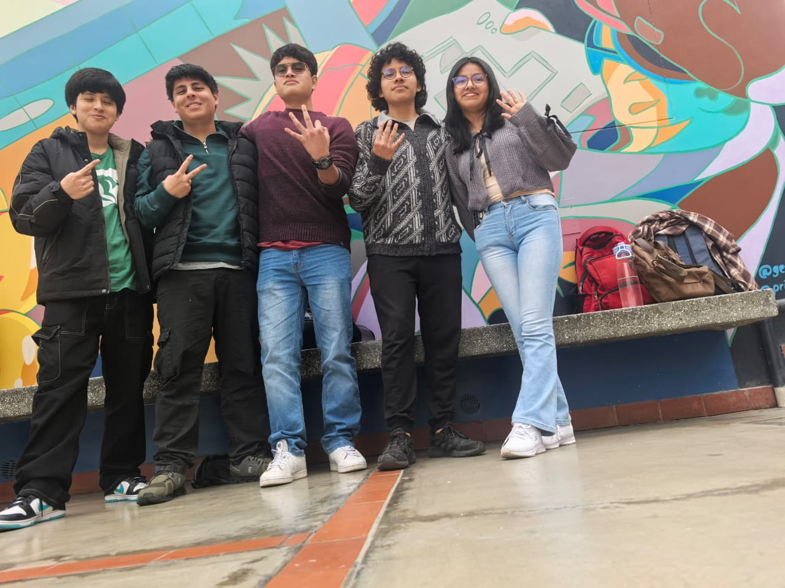

# Los Fantasticos 

# DESCRIPCIÓN DEL GRUPO 🐿️:
Somos estudiantes del segundo semestre de la carrera de Ingeniería Biomédica en la Universidad Peruana Cayetano Heredia. Nuestro grupo busca aplicar la creatividad, la innovación y el trabajo en equipo para afrontar los retos de la ingeniería aplicada a la salud.
# INTEGRANTES 🐿️:

🔧 Renzo Álvarez
 
 👨‍🔬 Nicolás Vergara  
⚙️ Álvaro Mendizábal  
💡 Rodrigo Gallardo  
🧬 Yamileth Mendoza  
---
🚀 **Los Fantásticos** – Unidos por la ciencia, impulsados por la innovación.  

